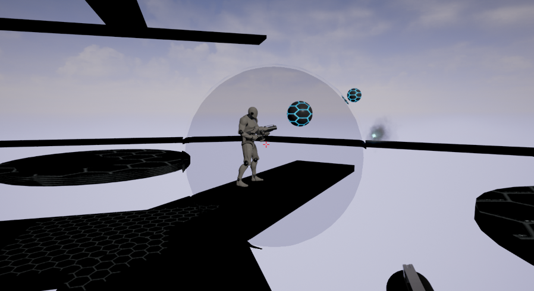
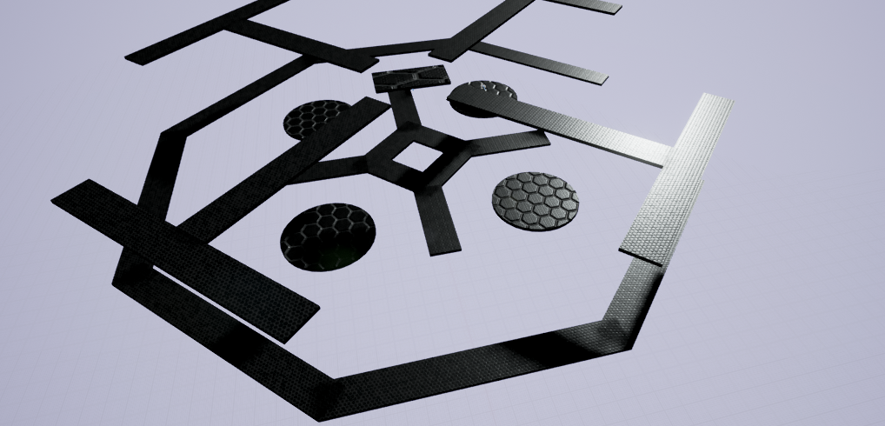
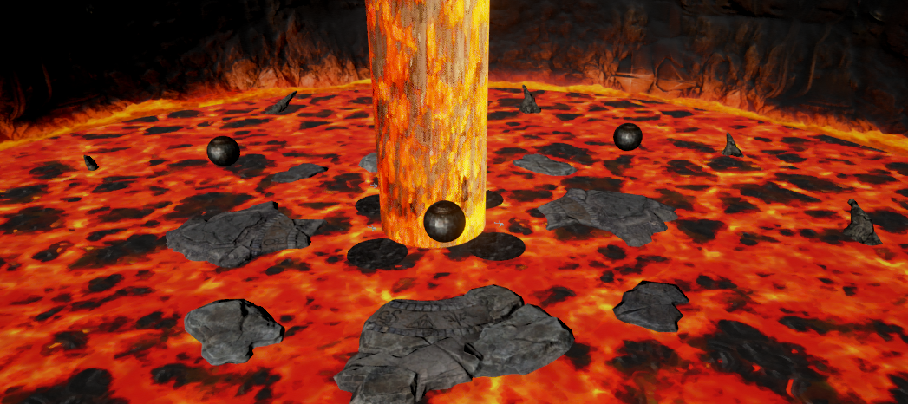

## How to run the game

Download and extract the .zip archive.
Run ElementalVector.exe.

Please note that the game requires a 64bit version of windows and a screen resolution of at least 1280x720.

## Description

Currently a prototype, Elemental Vector is a multiplayer first-person shooter.
Up to 4 players fight for survival in two different deadly arenas.
The only way to kill an enemy player is to push him in the void or a lethal element.

For this purpose, you can grap an orb and throw it at them to push them off a platform and interact with specific elements with your right click action. 

## Keys

* ZQSD or WASD to move your character
* Spacebar : Jump
* Left mouse button : Grab/Launch an orb
* Right mouse button : Interact

## Maps

###Eol

An aerial map with narrow catwalks. The second floor is a strategic position you should try to control. Mastering skill jumps would be a great help in this one.

#####Interactive elements :
* Bumpers (rendered as sparks bursts) can be activated for a short time, allowing you to access the second floor of the map.

###Lava Pit

A map with a deadly lava floor. The large stone platforms aren't very safe because of their trend to sink into the lava.
Some platforms are unstable, and might flip when you jump on it, so watch your step !

#####Interactive elements :
* Lava spheres can be projected to an enemy and kill them instantly.However if your foes are fast enough, they can project the spheres again while increasing their speed each time. Be careful of the backfire !
* Activating a metalic orb makes the stone platform underneath sink. After a short duration, it will go back to its original position. 

## Authors
This game was made as a student project by :

* Barre Romain
* Grégoire Clément
* Joubert Solène
* Nesme Vincent
