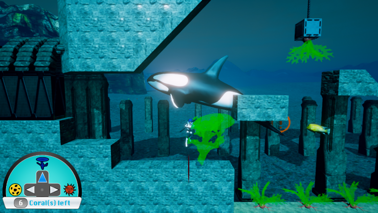
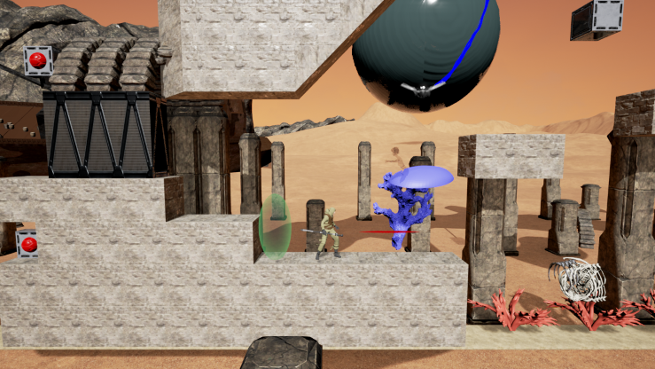

# This website will be updated with more content as soon as possible

Save the ocean by using an ancient force and by traveling through time to enable new possibilities!

### Description

The ocean was stolen by the Nemesians and locked in gigantic bubbles. 
Your objective is to free the waters and bring life back to those now arid lands by using the powers of your ancesters.
Using the help of his grand-mother from the past, the young Dæris will be able to progress through the desert and destroy the generators powering the ocean shackles.

### Ubisoft Game Lab Competition

This game is a prototype made for the **Ubisoft Game Lab Competition** 2016. For more information visit [https://montreal.ubisoft.com/en/game-lab-competition/](https://montreal.ubisoft.com/en/game-lab-competition/).

It was nominated for 3 awards out of 8 : Best Technical Challenge and Innovation, Best Game Design and Best Creativity and Integration of the Theme.

### How to run the game

Download and extract the .zip archive.
Run MemoryDrop.exe.

Please note that the game requires a XInput compatible **Gamepad Controller** and a 64bit version of windows. 
You might need to install some dependencies when launching the game for the first time.

### Controls

Press the Select button in-game to show the list of controls, note that all controls are explained in-game and are unlocked as you progress.

### FAQ

Q: The game complains about updating drivers or crashes when starting a new game.
A: Update your drivers, and make sure the right graphics card is used. (right click on MemoryDrop.exe -> Run with graphics processor -> Choose NVidia/ATI)

### Authors

* Barre Romain
* Descamps Benjamin
* Farine Nicolas
* Grégoire Clément
* Joubert Solène
* Nesme Vincent
* Pelloux-Prayer Ophélie
* Rodrigues Hugo

### Special thanks to :

#### Our professor and mentors

* Bob-Antoine-Jerry Ménélas
* Emery François
* Lasserre Jérôme

#### Concept artists

* Bellavance Julie
* Lounes Jaber
* Passet Fany

### Voices

* Barre Romain
* Gauthier-Monet Catherine
