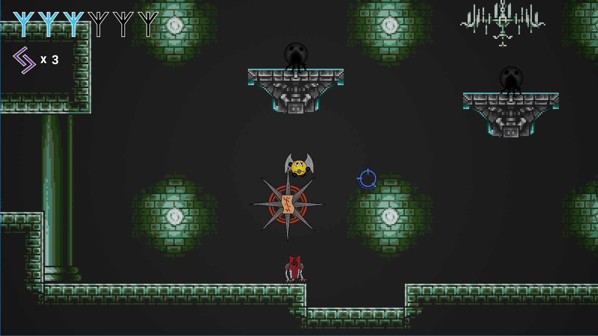

### How to run the game

Download and extract the .zip archive.
Run RuneOfRedemption.exe.

Please note that the game requires a 64bit version of windows and a screen resolution of at least 1280x720.

### Description

Currently a prototype, Rune of Redemption is a 2D Rogue-like action platformer.
The level is created using procedural generation.

Destroy every monster of the rooms in a fast-pace combat system to continue your journey.
Choose wisely your item from the chests to customize your character.
Will you be brave enough to explore this dungeon ?

### Keys

* A/Q : move left
* D : move right
* Spacebar : Jump/Double jump
* Left mouse button : Melee attack
* Right mouse button : Runic ranged attack (first impact : increases enemy's vulnerability, second impact : explodes)

### Authors
This game was made as a student project by :

* Barre Romain
* Grégoire Clément
* Joubert Solène
* Nesme Vincent
